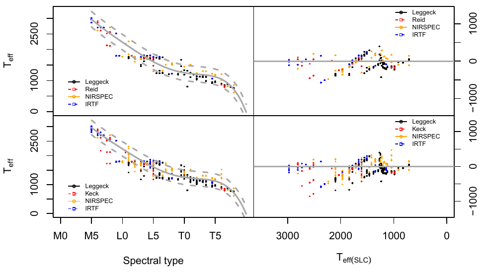

## Esquema de la presentación

1. Introducción: ¿qué es la misión espacial GAIA?
2. Los datos: ¿qué son las estrellas de baja masa ?
3. Estimación de los parámetros temperatura y gravedad.
4. Principales resultados y trabajo futuro.

---

## La misión espacial GAIA

El reto: realizar un censo de mil millones de estrellas.

> * Reto tecnológico:
  1. Gaia trazará un mapa de las estrellas desde el punto de 
  Lagrange L2, a una distancia de unos 1.5 millones de kilómetros de la
  Tierra.
  2. Mil millones de píxeles en las cámaras CCD.
  3. Transmitirá 5 años 50 Gb diarios. Al final de la misión,
  el archivo de datos excederá 1 Petabyte, que es 1 millón de Gbytes o el 
  equivalente a unos 200.000 DVD.

> * Reto científico: 
  1. Se registrarán un total de 70 mil millones de observaciones, cada 
  una de ellas compuesta a su vez de varios conjuntos de medidas.
  2. La posición de una estrella Gaia lo hará con una precisión
  extraordinaria, más allá de los sueños de cualquier astrónomo del 
  pasado.
  3. La astroestadística, la aplicación de técnicas y modelos 
  estadísticos a la astronomía, una disciplina todavía joven, se ha
  convertido en un eslabón fundamental para estudiar el 'tsunami' de datos
  de asteroides, estrellas, galaxias y cuásares que conviven en nuestro
  espacio exterior.

---

## La misión espacial GAIA

Consorcio para el procesado de datos (DPAC)

    

---

## La misión espacial GAIA

Consorcio para el procesado de datos (DPAC)

    

---

## La misión espacial GAIA

    

> * CU8 está encargada de la determinación de parámetros astrofísicos.
Dichos parámetros se determinan a partir de varios módulos en un 
pipeline llamado *Apsis*. 

> * Apsis incluye una clasificación inicial de los objetos en grandes
categorías, e integra módulos para estimar parámetros astrofísicos
dentro de cada una de esas categorías.

--- &twocol

## El módulo UCD dentro de Apsis: estrellas ultra frías

***=left
### Estrellas de baja masa

    

***=right

> 1. Contexto: GAIA contendrá un vasto número de objetos, incluyendo
estrellas enanas ultrafrías (temperatura por debajo de 2500 K)
> 2. Objetivo: Abordar la precisión de las estimaciones de la temperatura
y gravedad obtenidas a partir de modelos y observaciones actuales.

--- &twocol

## El módulo UCD dentro de Apsis: estrellas ultra frías

***=left
### Estrellas de baja masa

    

***=right
### Tracks evolutivos

    

---

## Datos para el módulo UCD. ¿Qué vemos realmente?

Espectros normalizados a partir de los modelos BT-Settl.

> Librerías de modelos estelares y los espectros sintéticos asociados
ofrecen un conjunto homogéneo que cubren uniformemente el espacio de
parámetros. (eno contraste los catálogos)
*reproducibilidad
* consistencia
* homogeneidad
* uniformidad

> Estas librerías parametrizan los modelos con magnitudes físicas
(temperatura efectiva, gravedades, y metalicidades)

> Son imperfectas, ya que no pueden reproducir exactamente todas
las características de un espectro real UCD.

> Los tipos espectrales pueden inferirse sin el uso de modelos
sintéticos, pero el camino de espectro a los parámetros físicos 
necesitan de éstas para su correcta interpretación.

> Dado el espectro de baja resolución de GAIA, la mayoría de las
características utilizadas para decidir el tipo espectral 
permanecen no resuletas o innobservadas. Hay que tener cuidado con las 
interpretaciones.

---

## La red neuronal

Los modelos sintéticos definen la relación entre los espcetros observados
por GAIA y los parámetros que queremos estimar $T_{eff}$ y $\log (x)$, 
temperatura y gravedad. Esta relación es capturada por un modelo de regresión mediante una red neuronal artificial. Perceptron multicapa, 

El conjunto de entrenamiento se construye utilizando las librerías
sintéticas ($T_{eff} < 4000K$) y transformando el espectro sintético
mediante GOG  

---

## Resultados utilizando KNN

Obtiene los parámetros como la media ponderada de los elementos
en el cojunto de entrenamiento que están más cercas del espectro 
de entrada para una métrica dada. Dicha métrica es la distancia
euclídea y los pesos son la inversa de dicha distancia.

> Desventaja, todo el cojunto de datos debe se accesible en todo 
momento. Y la técnica está afectada de la maldición de la dimensionalidad,
es decir, cuando crezca el espacio parámetrico el número de observaciones
debe aumentar exponencialmente para mantener una densidad adecuadad de 
vecinos próximos.

---

## Resultados utilizando procesos gausianos

Se define como una distribución de probabilida sobre las funciones
de forma que la probabilidad conjunta de las variables aleatorias
definidas por sus evaluaciones en cierto conjunto de vectores (
el training set) es Gaussiano.

---

## Inferencia Bayesiana.

No da una estimación de los parámetros, sino una distribución 
de probabilidad para los mismos:

$$p (\theta | s) = \frac{p(s|\theta)
p(\theta)}{\int p(s|\theta) p(\theta) \, d \theta} $$

donde $\theta = (T_{eff}, \log (g))$. En realidad la verosimilitud es 

$$s|\theta = s|(s_{model}, \Sigma) \sim \mathcal{N} (s_{model},\Sigma) $$

con $s_{model}$ el espectro obtenido mediante la rna para $\theta$.

---

## Inferencia Bayesiana. Nested Sampling

Para caracterizar a $p(\theta|s)$ utilizamos una técnica MCMC llamada
*Nested Sampling*. Brevemente, el algoritmo explora la relación entre 
la verosimilitud y el *volumen de distribución previa* definido por

$$X (\lambda) = \int_{p(s|\theta) > \lambda} p(\theta) \, d \theta$$

el volumen de distribución previa contenido en la región paramétrica
contenida dentro del iso-contorno $p(s|\theta) > \lambda$

$$p_i = \frac{p(s | \theta_i) \cdot w_i}{\hat{m(s)}},$$

con $w_i = 0.5(X_{i-1}-X_i)$ y
$\hat{T}_{eff}= \sum_{i = 1}^n T_{eff, i} \cdot p_i$

Imagen de John Skilling, copiada de la charla 

http://www.inference.phy.cam.ac.uk/bayesys/Valencia.pdf

--

## Inferencia Bayesiana. Resultados

---

## Trabajo actual y futuro de la estimación

> Ampliar las distribuciones previas a copulas, simulando la relación
entre la temperatura y gravedad. Primera aproximación en TFG de Marta Sánchez, obteniendo mejores resultados en la estimación.

> Paralelizar la verosimilitud. Primeras pruebas con arquitectura Spark.

---

## Gracias

No oliden descargarse al app!

