<a href="https://github.com/AngelBerihuete/SEIO2015">Fork me on GitHub</a>

 

 

 

## Estimación de parámetros 

## físicos en estrellas de baja masa

 

bajo el marco de la misión espacial GAIA

 

<small> <a href= "mailto:angel.berihuete@uca.es" >A. Berihuete,</a> L. M. Sarro, A. Suárez, D. Barrado, C. Carrión, M. Sánchez
 
 

Universidad de Cádiz
 
Universidad Nacional de Educación a Distancia
 
Centro de Astrobiología

</small>

---

## Esquema de la presentación

1. Contexto: ¿qué es la misión espacial GAIA?
2. Los datos: ¿qué son las estrellas de baja masa?
3. Estimación parámetrica. Principales  resultados.
4. Trabajo actual y futuro.

--- &twocol

## La misión espacial GAIA

*** =left

<figure>

    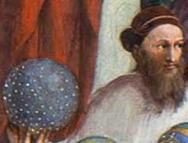

<figcaption><small>
Fuente Wikipedia
 
Hiparco de Nicea
</small></figcaption>
</figure>

*** =right

<figure>

    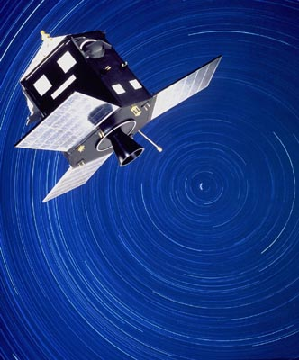

<figcaption><small>
Fuente ESA. Satelite Hipparcos 
 
(The High Precision Parallax Collecting Satellite)
</small></figcaption>
</figure>

--- &twocol

## La misión espacial GAIA

<figure>

<video width="512" data-autoplay controls src="Gaialaunch.mp4" type="video/mp4"></video>

</figure>

*** =left

 Reto tecnológico 

106 CCDs con 8 millones de pixels cada uno.

Transmitirá, durante 5 años, 50 Gb diarios. Al final de la misión el archivo de datos excederá el Petabyte.

*** =right

 Reto científico 

Se registrarán un total de 70 mil millones de observaciones, cada una de ellas compuesta a su vez de varios conjuntos de medidas.

La astrometría será la mejor conseguida hasta ahora.

--- &twocol

## La misión espacial GAIA
 

 El reto:  un censo de 
 mil millones de estrellas 

 

*** =left

<figure>

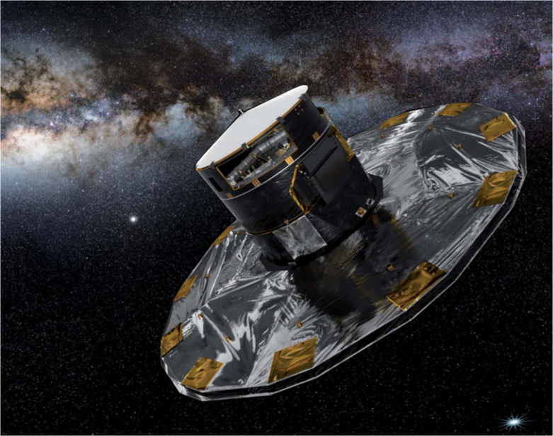

<figcaption><small>
Fuente ESA
</small></figcaption>
</figure>

*** =right

 
 

La  Astroestadística  
se ha convertido en eslabón fundamental para el análisis y 
contraste de modelos en las grandes bases de la Astronomía actual.

--- &twocol

## La misión espacial GAIA

 

Consorcio para el procesado de datos (DPAC)

 

*** =left

<figure>

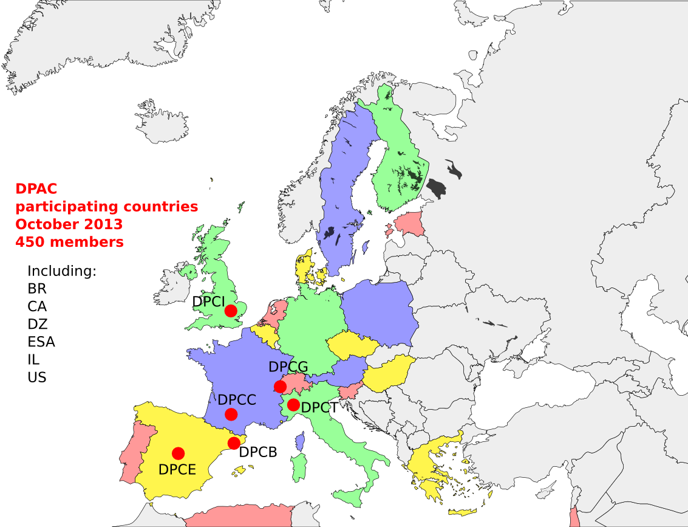

<figcaption><small>
Fuente ESA
</small></figcaption>
</figure>

*** =right
<figure>

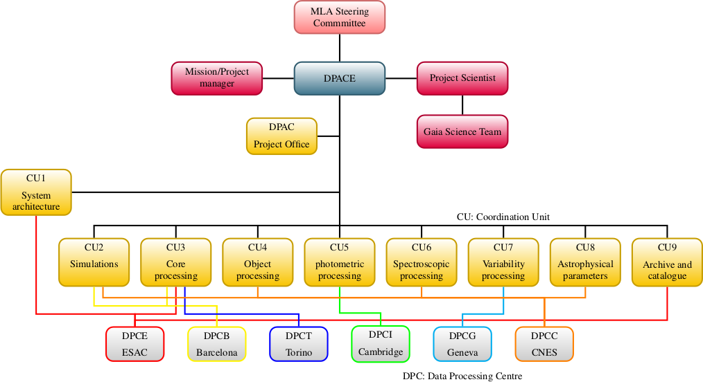

<figcaption><small>
Fuente ESA
</small></figcaption>
</figure>

--- &twocol

## La misión espacial GAIA

CU8 está encargada de la determinación de parámetros astrofísicos. Dichos parámetros se determinan a partir de varios módulos en un  pipeline llamado [Apsis](http://www.aanda.org/articles/aa/abs/2013/11/aa22344-13/aa22344-13.html)

 

*** =left

    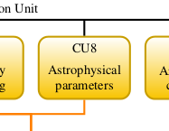

*** =right

.fragment El módulo [Apsis](http://www.aanda.org/articles/aa/abs/2013/11/aa22344-13/aa22344-13.html) incluye una clasificación inicial de los objetos en grandes categorías, e integra módulos para estimar parámetros astrofísicos dentro de cada una de esas categorías.

--- &twocol

## El módulo UCD

### estrellas enanas ultra frías

 

***=left

<figure>

    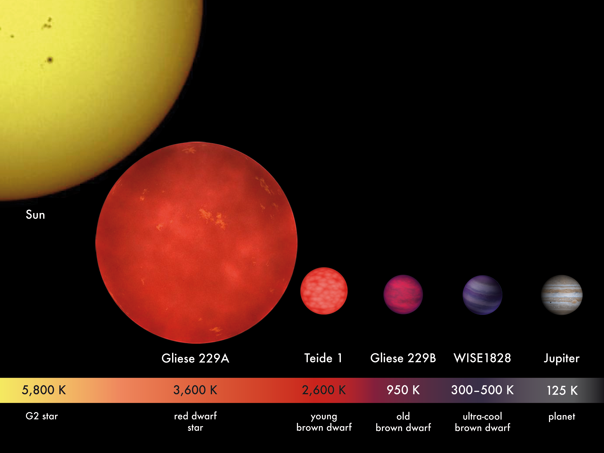

<figcaption><small>
Fuente Wikipedia
</small></figcaption>
</figure>

***=right

Contexto:  GAIA contendrá un vasto número de objetos, incluyendo estrellas enanas ultrafrías (temperatura por debajo de 2500 K)

Objetivo: Abordar la precisión de las estimaciones de la temperatura y gravedad obtenidas a partir de modelos y observaciones actuales.

--- &twocol

## El módulo UCD

### estrellas enanas ultra frías

 

***=left

<figure>

    

<figcaption><small>
Fuente Wikipedia
</small></figcaption>
</figure>

***=right

### 

<figure>

    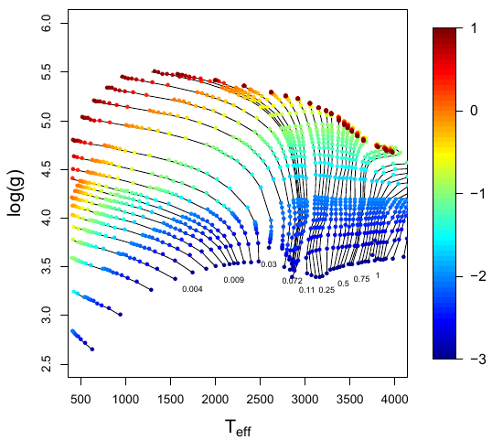

<figcaption><small>
Tracks evolutivos
 
Fuente <a href="http://www.aanda.org/articles/aa/abs/2013/02/aa19867-12/aa19867-12.html">Sarro et al.</a>
</small></figcaption>
</figure>

---

## Datos para el módulo UCD

### ¿qué vemos realmente?

<figure>

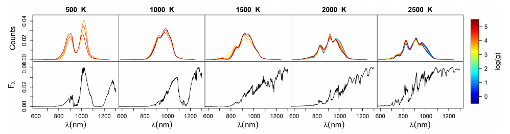

<figcaption><small>
Espectros normalizados a partir de la biblioteca de modelos BT-Settl
 
Fuente <a href="http://www.aanda.org/articles/aa/abs/2013/02/aa19867-12/aa19867-12.html">Sarro et al.</a>
</small></figcaption>
</figure>

 

Bibliotecas de modelos estelares y los espectros sintéticos asociados
ofrecen un conjunto homogéneo que cubren uniformemente el espacio de
parámetros.

---

## Datos para el módulo UCD

### ¿qué vemos realmente?

<figure>

<figcaption><small>
Espectros normalizados a partir de la biblioteca de modelos BT-Settl
 
Fuente <a href="http://www.aanda.org/articles/aa/abs/2013/02/aa19867-12/aa19867-12.html">Sarro et al.</a>
</small></figcaption>
</figure>

 

Estas bibliotecas parametrizan los modelos con magnitudes físicas (temperatura efectiva, gravedades, y metalicidades)

.fragment Son imperfectas, ya que no pueden reproducir exactamente todas las características de un espectro real UCD.

---

## Datos para el módulo UCD

### ¿qué vemos realmente?

<figure>

<figcaption><small>
Espectros normalizados a partir de la biblioteca de modelos BT-Settl
 
Fuente <a href="http://www.aanda.org/articles/aa/abs/2013/02/aa19867-12/aa19867-12.html">Sarro et al.</a></small></figcaption>
</figure>

Los tipos espectrales pueden inferirse sin el uso de modelos sintéticos, pero el camino de espectro a los parámetros físicos necesitan de éstas para su correcta interpretación.

.fragment Dado el espectro de baja resolución de GAIA, la mayoría de las características utilizadas para decidir el tipo espectral permanecen no resueltas o innobservadas, i.e., cuidado con las interpretaciones.

---

## Datos para el módulo UCD

### ¿qué vemos realmente?

<figure>

<figcaption><small>
Espectros normalizados a partir de la biblioteca de modelos BT-Settl
 
Fuente <a href="http://www.aanda.org/articles/aa/abs/2013/02/aa19867-12/aa19867-12.html">Sarro et al.</a>
</small></figcaption>
</figure>

 

Los modelos sintéticos definen la relación entre los espcetros observados por GAIA y los parámetros que queremos estimar $T_{eff}$ y $\log (g)$,  temperatura y gravedad. Esta relación es capturada por un modelo de regresión mediante una red neuronal artificial (perceptron multicapa).

---

## Datos para el módulo UCD

### ¿qué vemos realmente?

<figure>

<figcaption><small>
Espectros normalizados a partir de la biblioteca de modelos BT-Settl
 
Fuente <a href="http://www.aanda.org/articles/aa/abs/2013/02/aa19867-12/aa19867-12.html">Sarro et al.</a>
</small></figcaption>
</figure>

 

El conjunto de entrenamiento se construye utilizando las bibliotecas sintéticas ($T_{eff} < 4000K$) y transformando el espectro sintético mediante el Gaia Object Generator (GOG).

---

## Estimación paramétrica

  * Bibliotecas sintéticas de espectros vistas por GAIA: modelos.
  * Bibliotecas sintéticas y espectros obtenidos en tierra vistas por GAIA: observaciones.

 

<figure>

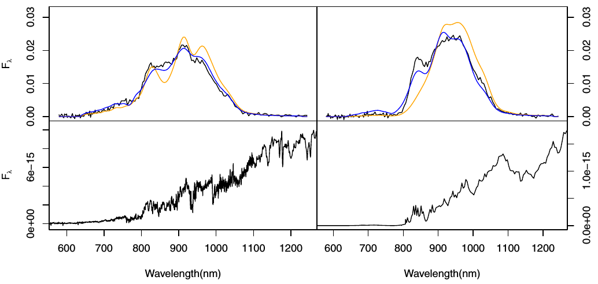

<figcaption><small>
Comparación de espectros vistos por GAIA
 
Fuente <a href="http://www.aanda.org/articles/aa/abs/2013/02/aa19867-12/aa19867-12.html">Sarro et al.</a>
</small></figcaption>
</figure>

---

## Estimación paramétrica

<strong> Recordemos  objetivo  </strong>: Abordar la precisión de las estimaciones de la temperatura
y gravedad obtenidas a partir de modelos y observaciones actuales.

  

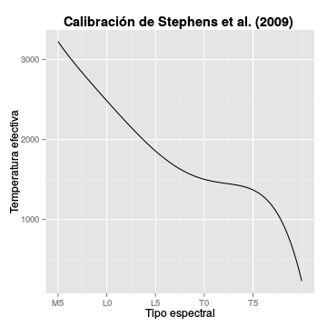

---

## Estimación paramétrica

### KNN

<figure>

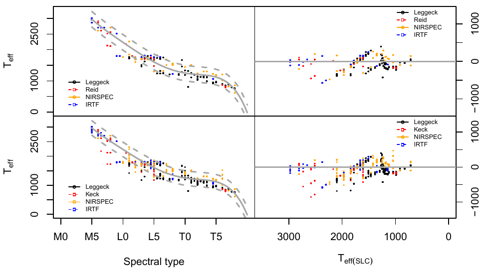

<figcaption><small>
Resultados utilizando KNN
 
Fuente <a href="http://www.aanda.org/articles/aa/abs/2013/02/aa19867-12/aa19867-12.html">Sarro et al.</a>
</small></figcaption>
</figure>

---

## Estimación paramétrica

### Procesos Gausianos

<figure>

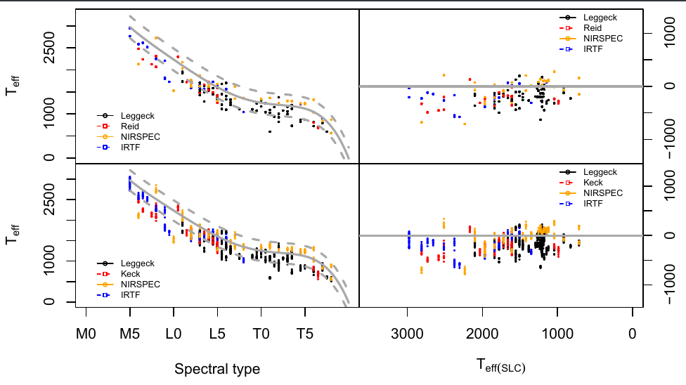

<figcaption><small>
Resultados utilizando PG
 
Fuente <a href="http://www.aanda.org/articles/aa/abs/2013/02/aa19867-12/aa19867-12.html">Sarro et al.</a>

</small></figcaption>
</figure>

---

## Estimación paramétrica

### Bayes

<figure>

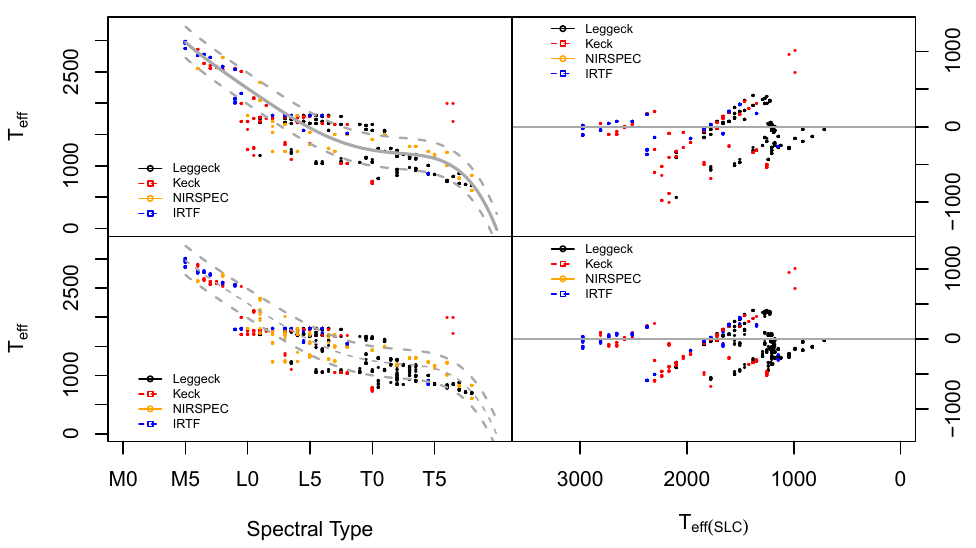

<figcaption><small>
Resultados para Nested Sampling con $\theta \sim \mathcal{U} (400, 4000) \times (3.5, 5.5)$
 
Fuente <a href="http://www.aanda.org/articles/aa/abs/2013/02/aa19867-12/aa19867-12.html">Sarro et al.</a>
</small></figcaption>
</figure>

---

## Inferencia Bayesiana

*  Ventajas : No solo da una estimación de los parámetros, sino una 
distribución de probabilidad para los mismos.
*  Desventajas: Complejidad del modelo, consumo computacional elevado.

$$p (\theta | s) = \frac{p(s|\theta)
p(\theta)}{\int p(s|\theta) p(\theta) \, d \theta}
\propto p(s|\theta) p(\theta),
$$

donde $\theta = (T_{eff}, \log (g))$. En realidad la verosimilitud es 

$$s|\theta = s|(s_{model}, \Sigma) \sim \mathcal{N} (s_{model},\Sigma),$$

con $s_{model}$ el espectro obtenido mediante la RNA para $\theta$.

--- &twocol

## Inferencia Bayesiana

Para caracterizar a $p(\theta|s)$ utilizamos el algoritmo
 Nested Sampling : exploramos la relación entre $p(s|\theta)$ y el *volumen de distribución previa* definido por $X (\lambda) = \int_{p(s|\theta) > \lambda} p(\theta) \, d \theta$, el volumen de distribución previa contenido en la región paramétrica contenida dentro del iso-contorno $p(s|\theta) > \lambda$

*** =left

<figure>

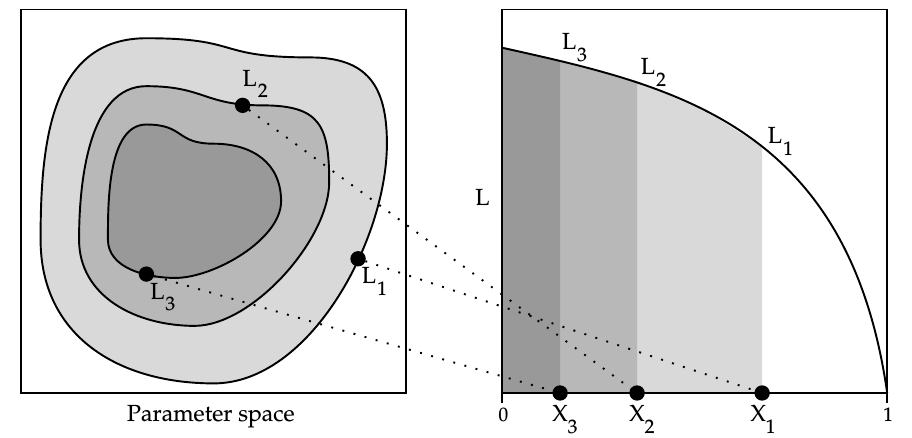

<figcaption>
<small>
Fuente <a href="http://www.inference.phy.cam.ac.uk/bayesys/Valencia.pdf">John Skilling (Proc. Valencia / ISBA)</a>
</small>
</figcaption>
</figure>

*** =right

Además $p_i = \frac{p(s | \theta_i) \cdot w_i}{\widehat{m(s)}}$,

con $w_i = 0.5 ( X_{i-1} - X_i ) $. ADemás

$$ \widehat{T}_{eff} = \sum_{i = 1}^n T_{eff, i} \cdot p_i $$

--- &twocol

## Inferencia Bayesiana

*** =left

<figure>

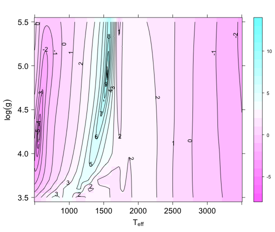

<figcaption><small>
$\log p(s| \theta)$ para modelo BT-Settl 1500K
 
Fuente <a href="http://www.aanda.org/articles/aa/abs/2013/02/aa19867-12/aa19867-12.html">Sarro et al.</a>
</small></figcaption>
</figure>

*** =right

<figure>

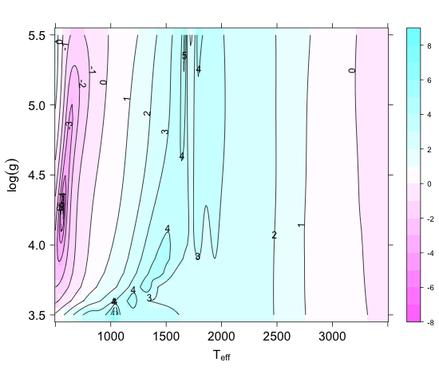

<figcaption><small>
$\log p(s| \theta)$ para spectro con ruido SDSS0107 (G=20)
 
Fuente <a href="http://www.aanda.org/articles/aa/abs/2013/02/aa19867-12/aa19867-12.html">Sarro et al.</a>
</small></figcaption>
</figure>

---

## Inferencia Bayesiana

<figure>

<figcaption><small>
Resultados para Nested Sampling  con $\theta \sim \mathcal{U} (400, 4000) \times (3.5, 5.5)$
 
Fuente <a href="http://www.aanda.org/articles/aa/abs/2013/02/aa19867-12/aa19867-12.html">Sarro et al.</a>
</small></figcaption>
</figure>

--- &twocol

## Distribución previa mediante cópula

Ampliar las distribuciones previas a copulas, simulando la relación
entre la temperatura y gravedad. Primera aproximación en TFG de Marta Sánchez, obteniendo mejores resultados (densidades unimodales).

*** =left

<figure>

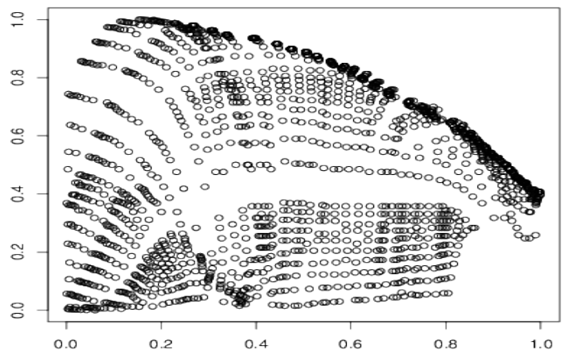

<figcaption><small>
Relación temperatura gravedad
 
Fuente TFG Marta Sánchez

</small></figcaption>
</figure>

*** =right

<figure>

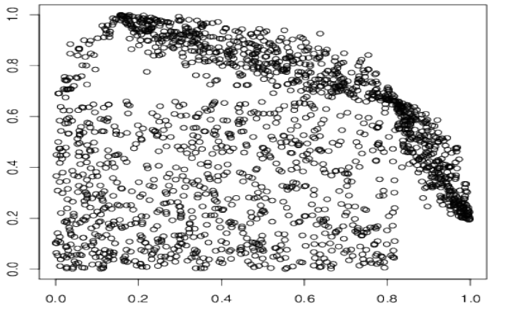

<figcaption><small>
mixtura de distribuciones uniformes y cópula normal
 
Fuente TFG Marta Sánchez
</small></figcaption>
</figure>

--- &twocol

## Distribución previa mediante cópula

Ampliar las distribuciones previas a copulas, simulando la relación
entre la temperatura y gravedad. Primera aproximación en TFG de Marta Sánchez, obteniendo mejores resultados (menor error de estimación).

*** =left

<figure>

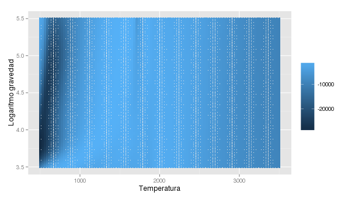

<figcaption><small>
Relación temperatura gravedad
 
Fuente TFG Marta Sánchez

</small></figcaption>
</figure>

*** =right

<figure>

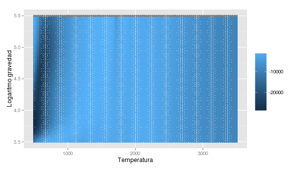

<figcaption><small>
log posterior con previa cópula
 
Fuente TFG Marta Sánchez
</small></figcaption>
</figure>

--- 

## Distribución posterior 

### temperatura y gravedad

<small>
Fuente TFG Marta Sánchez
</small>

    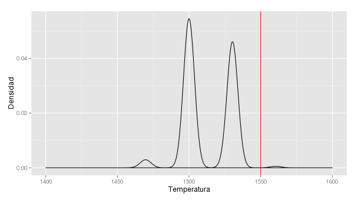
    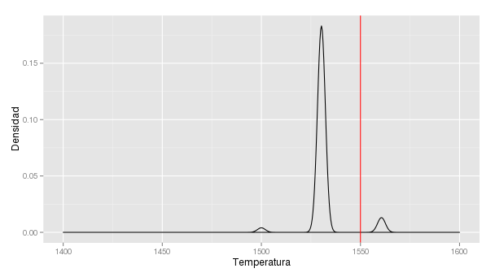

    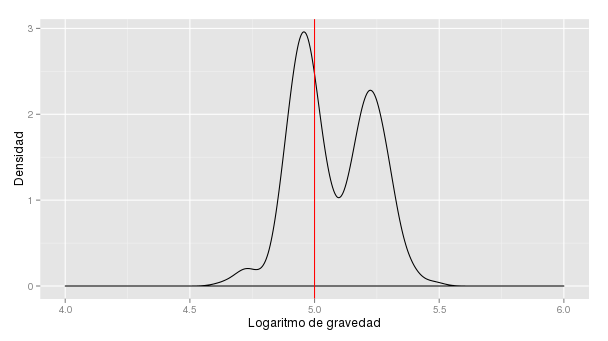
    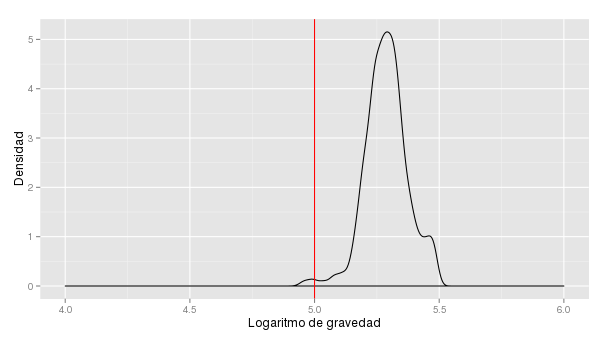

---

## Trabajo en curso

<ul>
<li> Jerarquizar el modelo. </li>
<li> Paralelización del algoritmo, High Perfomance Computing para emcee, y/o HMC (programación en Python y R)</li>
<li>Paralelización de la verosimilitud

$$ \log p(s | \theta) = \sum_{i=1}^n \log  p(s_i | \theta), \quad n>> $$

Hemos utilizado colas Condor, Slrum, y estamos con las primeras pruebas en arquitectura Spark. ¿Es la arquitectura correcta?
</li>
</ul>

---

## Gracias

¡No olviden descargarse al app!

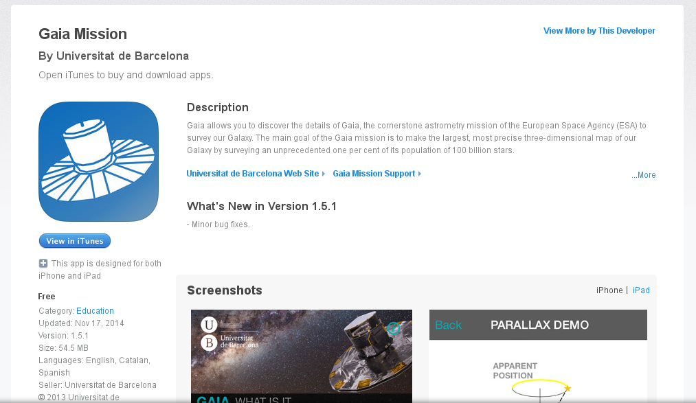
